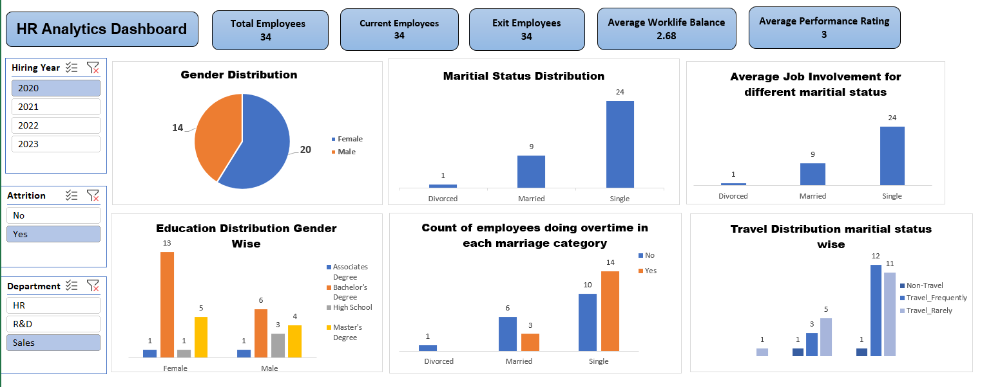

# 📊 HR Analytics Dashboard Project

An interactive **HR Analytics Dashboard** built in **Microsoft Excel** to analyze employee data and generate meaningful workforce insights. The dashboard uses **PivotTables, PivotCharts, Slicers, KPIs, and Excel functions** to visualize HR metrics such as employee demographics, attrition, education, overtime, travel frequency, and performance.

---

## 📌 Project Overview

This project provides a comprehensive analysis of HR data through an interactive dashboard. It enables HR professionals and business stakeholders to monitor workforce trends, identify employee patterns, and make data-driven decisions.

---

## 🚀 Features

- 📈 Interactive HR Dashboard
- 👥 Employee Demographics Analysis
- 🚻 Gender Distribution
- 💍 Marital Status Distribution
- 🎓 Education Distribution by Gender
- ⏱️ Overtime Analysis
- ✈️ Business Travel Analysis
- 📅 Hiring Year Filter
- 🏢 Department Filter
- ❌ Attrition Filter
- 📊 Dynamic Pivot Charts
- 🎯 KPI Cards

---

## 📊 Dashboard KPIs

- Total Employees
- Current Employees
- Exit Employees
- Average Work-Life Balance
- Average Performance Rating

---

## 📂 Dataset

The dashboard is created using an HR employee dataset containing information such as:

- Employee ID
- Gender
- Department
- Hiring Year
- Education
- Marital Status
- Attrition
- Overtime
- Business Travel
- Performance Rating
- Work-Life Balance

---

## 🛠️ Tools & Technologies

- Microsoft Excel
- Pivot Tables
- Pivot Charts
- Slicers
- Excel Functions
- Conditional Formatting

---

## 📷 Dashboard Preview



---

## 📁 Repository Structure

```
HR-Analytics-Dashboard-Project/
│
├── Dashboard.png
├── HR Analytics Dashboard.xlsx
├── HR Data.csv
└── README.md
```

---

## 📈 Key Insights

- Analyze workforce demographics.
- Track employee attrition.
- Compare overtime across different employee groups.
- Understand education distribution by gender.
- Analyze travel frequency among employees.
- Monitor work-life balance and performance ratings.

---

## 💡 Skills Demonstrated

- Data Cleaning
- Data Analysis
- Data Visualization
- Dashboard Design
- KPI Reporting
- Business Intelligence
- Microsoft Excel
- Pivot Tables
- Pivot Charts
- Interactive Reporting

---

## 🎯 Business Use Cases

- HR Workforce Analysis
- Employee Performance Monitoring
- Attrition Analysis
- Employee Demographics Reporting
- Department-wise Workforce Analysis
- HR Decision Support

---

## 👨‍💻 Author

**Vaibhav Sudhir Kulkarni**

📧 Email: *(Add your email here)*

🔗 LinkedIn: https://www.linkedin.com/in/vaibhav-kulkarnii/

🔗 GitHub: https://github.com/Vaibhav-Kulkarnii

---

## ⭐ Support

If you found this project useful, please consider giving it a ⭐ on GitHub.

---

## 📜 License

This project is created for learning, portfolio, and educational purposes.
